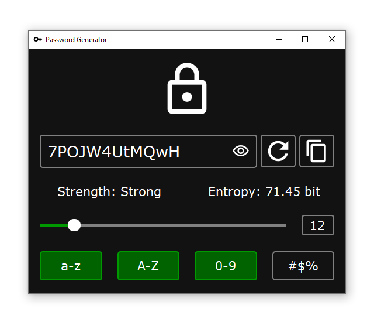
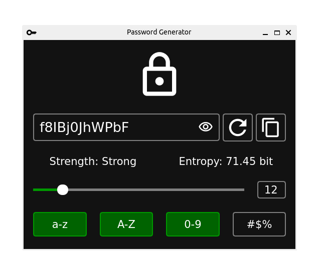
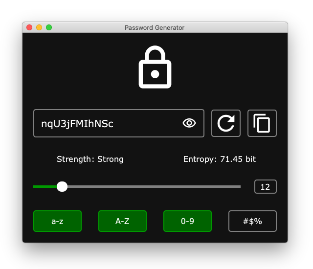

# Password Generator

[](#download)

[](https://www.youtube.com/watch?v=WHSqprSMjnQ)

Cross-platform GUI password generator written in Python

## Screenshots

- Windows 10



- Ubuntu 22.04



- macOS 10.15 Catalina



## Download

[Last release](https://github.com/lesskop/password-generator/releases/tag/v1.0)

- [Windows](https://github.com/lesskop/password-generator/releases/download/v1.0/password-generator-v1.0-win64.zip)
- [Linux](https://github.com/lesskop/password-generator/releases/download/v1.0/password-generator-v1.0-linux64.tar.gz)
- [macOS](https://github.com/lesskop/password-generator/releases/download/v1.0/password-generator-v1.0-macos.tar.gz)

## Installation

1. You should have [Python 3.7+](https://www.python.org/downloads/) and [Git](https://git-scm.com/downloads) installed on your local machine.

2. Clone the repository:

```bash
git clone https://github.com/lesskop/password-generator.git
```

3. Change the directory:

```bash
cd password-generator
```

4. Create a virtual environment (recommended):

```bash
python -m venv venv
```

5. Activate it:

- Windows:

```bash
venv\Scripts\activate
```

- Linux/macOS:

```bash
source venv/bin/activate
```

6. Install dependencies:

```bash
pip install -r requirements.txt
```

## Usage

Run application with command:

```bash
python src/app.py
```

or

```bash
cd src
python app.py
```

## Tutorials

[YouTube video](https://youtu.be/WHSqprSMjnQ)

[Статья на Хабре](https://habr.com/p/689536)